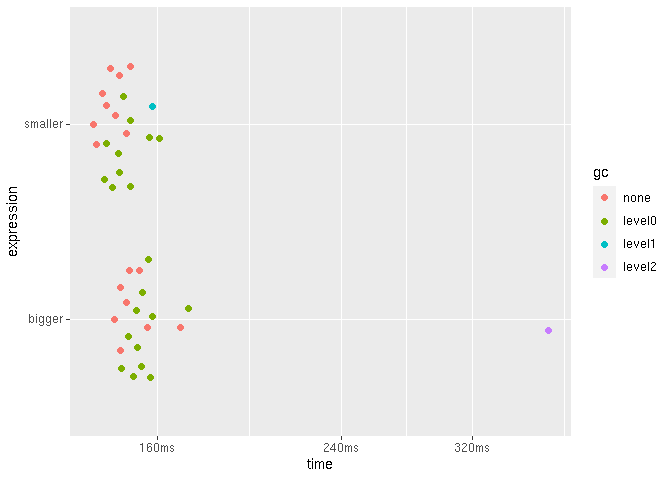

Working with big data
================
true
07-20-2020

## Setup

``` r
# Packages
library(tidyverse)
library(fs)
library(vroom)
library(glue)
library(bench)
library(r2dii.data)
library(r2dii.match)
packageVersion("r2dii.match")
#> [1] '0.0.3.9001'

# Example datasets
lbk_full <- loanbook_demo
ald_full <- ald_demo
```

## How do you eat an elephant?

One way to save time and memory is to use less data. Even if you
downsize your data, you may achieve the exact same result, or achieve a
slightly different result that is equally informative.

### Use just the columns you need

Your loanbook dataset may be unnecessarily big; it may have columns that
`match_name()` doesn’t use but make it less efficient. If you feed
`match_name()` with only the crucial columns it needs, you may save time
and memory.

``` r
dim(lbk_full)
#> [1] 320  19

lbk_crucial_cols <- lbk_full %>% select(crucial_lbk())
dim(lbk_crucial_cols)
#> [1] 320   6
```

Compare:

``` r
benchmark <- bench::mark(
  check = FALSE,
  iterations = 20,
  lbk_full = match_name(lbk_full, ald_demo),
  lbk_crucial_cols  = match_name(lbk_crucial_cols, ald_demo)
)

ggplot2::autoplot(benchmark)
```

<!-- -->

The difference here is small, but can increase with the size of the
data.

## Chunk your data

Before you saw that one way to save time and memory is to use fewer
columns of the loanbook dataset. And you can work yet more efficiently
if you use fewer rows of the ald dataset. One way is to focus on a
single sector.

``` r
dim(ald_full)
#> [1] 17368    13

ald_one_sector <- filter(ald_full, sector == "power")
dim(ald_one_sector)
#> [1] 8187   13
```

Compared to using the full datasets, this should use less time and
memory.

``` r
benchmark <- bench::mark(
  check = FALSE,
  iterations = 30,
  full = match_name(lbk_full, ald_full),
  crucial_cols_one_sector = match_name(lbk_crucial_cols, ald_one_sector)
)

ggplot2::autoplot(benchmark)
```

<!-- -->

To study multiple sectors you can process each one at a time. Each
result may be large, and storing it in memory may cause your computer to
crash. Instead, you can save the output of each sector to a file.

``` r
# Create a directory to store the output
directory <- "output"
if (!dir_exists(directory)) dir_create(directory)

ald_power <- filter(ald_full, sector == "power")
matched_power <- match_name(lbk_crucial_cols, ald_power)
vroom::vroom_write(matched_power, path = "output/power.csv")

ald_aviation <- filter(ald_full, sector == "aviation")
matched_power <- match_name(lbk_crucial_cols, ald_aviation)
vroom::vroom_write(matched_power, path = "output/aviation.csv")

# See the output files we saved
all_sectors <- fs::dir_ls(directory)
all_sectors
#> output/aviation.csv output/power.csv
```

When you are ready, combine all results and continue the analysis.

``` r
matched <- vroom::vroom(all_sectors)
#> Rows: 184
#> Columns: 15
#> Delimiter: "\t"
#> chr [12]: id_ultimate_parent, name_ultimate_parent, id_direct_loantaker, name_direct_loant...
#> dbl [ 3]: rowid, sector_classification_direct_loantaker, score
#> 
#> Use `spec()` to retrieve the guessed column specification
#> Pass a specification to the `col_types` argument to quiet this message
matched
#> # A tibble: 184 x 15
#>    rowid id_ultimate_par… name_ultimate_p… id_direct_loant… name_direct_loa…
#>    <dbl> <chr>            <chr>            <chr>            <chr>           
#>  1   316 UP7              Airasia X Bhd    C3               Airasia X Bhd   
#>  2   316 UP7              Airasia X Bhd    C3               Airasia X Bhd   
#>  3   317 UP8              Airbaltic        C4               Airbaltic       
#>  4   317 UP8              Airbaltic        C4               Airbaltic       
#>  5   318 UP9              Airblue          C5               Airblue         
#>  6   318 UP9              Airblue          C5               Airblue         
#>  7   319 UP10             Airborne Of Swe… C6               Airborne Of Swe…
#>  8   319 UP10             Airborne Of Swe… C6               Airborne Of Swe…
#>  9   320 UP11             Airbus Transpor… C7               Airbus Transpor…
#> 10   320 UP11             Airbus Transpor… C7               Airbus Transpor…
#> # … with 174 more rows, and 10 more variables:
#> #   sector_classification_system <chr>,
#> #   sector_classification_direct_loantaker <dbl>, id_2dii <chr>, level <chr>,
#> #   sector <chr>, sector_ald <chr>, name <chr>, name_ald <chr>, score <dbl>,
#> #   source <chr>

# How many matches per sector?
count(matched, sector)
#> # A tibble: 2 x 2
#>   sector       n
#>   <chr>    <int>
#> 1 aviation    10
#> 2 power      174
```
