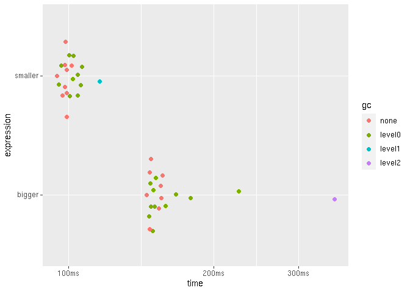

Working with big data
================
true
07-20-2020

Packages:

``` r
library(tidyverse)
library(fs)
library(vroom)
library(glue)
library(bench)
packageVersion("bench")
#> [1] '1.1.1.9000'
library(r2dii.data)
library(r2dii.match)
packageVersion("r2dii.match")
#> [1] '0.0.3.9000'
```

## Use less data

One way to save time and memory is to use less data. Even if you
downsize your data, you may achieve the exact same result, or achieve a
slighly different result that is equally informative.

### Use just the columns you need

Your datasets may have columns `match_name()` doesn’t need.

``` r
dim(loanbook_demo)
#> [1] 320  19

dim(ald_demo)
#> [1] 17368    14
```

`match_name()` needs only these columns:

``` r
lbk_used <- c(
  "sector_classification_system",
  "id_ultimate_parent",
  "name_ultimate_parent",
  "id_direct_loantaker",
  "name_direct_loantaker",
  "sector_classification_direct_loantaker"
)

ald_used <- c("name_company", "sector")
```

If you pick just what you need, you may be able to work with smaller
data.

``` r
lbk <- loanbook_demo[lbk_used]
dim(lbk)
#> [1] 320   6

ald <- ald_demo[ald_used]
dim(ald)
#> [1] 17368     2
```

These can use less time and memory:

``` r
benchmark <- bench::mark(
  check = FALSE,
  iterations = 30,
  full_columns = match_name(loanbook_demo, ald_demo),
  used_columns = match_name(lbk, ald)
)

ggplot2::autoplot(benchmark)
```

<!-- -->

## Chunk your data

One way to use less memory is to feed `match_name()` with data of a
single sector at a time, then save the output to a directory. Later we
can import the results for all sectors, combine them, and continue the
analysis.

I’ll write a helper function that matches a full `loanbook` with a
sector-chunk of `ald`, then write a .csv file into a directory. I’ll
then iterate over each sector with `purrr::walk()`, which is ideal for
side effects like creating plots, or writing files to disk. To read and
write data I’ll use the package vroom; it is fast, and it can import
multiple files into a single data frame.

``` r
library(tidyverse)
library(fs)
library(glue)
library(vroom)
library(r2dii.data)
library(r2dii.match)
packageVersion("r2dii.match")

# Helper to match one sector, then write a file into a directory
match_each_sector <- function(sector, directory, loanbook, ald, ...) {
  matched <- match_name(loanbook, pluck(ald, sector, ...))
  # Write a file for each sector with one or more matches
  file_path <- path(directory, glue("{sector}.csv"))
  if (nrow(matched) > 0L) vroom_write(matched, file_path)
  
  # Good practice for functions called primarily for their side effects
  invisible(sector)
}


# Create a directory to store the output
directory <- "output"
if (!dir_exists(directory)) dir_create(directory)


# Import big data
loanbook_path <- "~/Downloads/prof/lbk18.csv"
loanbook <- vroom(loanbook_path)
file_size(loanbook_path)
dim(loanbook)

ald_path <- "~/Downloads/prof/ald-babynames.csv"
ald <- vroom(ald_path)
file_size(ald_path)
dim(ald)


# Try small data before running a time-consuming process

# Pick the first few rows
loanbook_small <- head(loanbook, 50)

# Pick the first few rows
ald_small <- head(ald, 50)
# Split by sector
ald_small_split <- split(ald_small, ald_small$sector)

names(ald_small_split) %>% 
  walk(~ match_each_sector(.x, directory, loanbook_small, ald_small_split))

# Read all files into a single data frame
matched <- vroom(dir_ls(directory))
matched

# Quick view of how much data we have by sector. Missing sectors 
matched %>% nest_by(sector)

# It worked. Let's cleanup before we run the full data
file_delete(dir_ls(directory))

# All files are now gone
dir_ls(directory)


# # The big run
# ald_split <- split(ald, ald$sector)
# names(ald_split) %>% 
#   walk(~ match_each_sector(.x, directory, loanbook, ald_split))
# 
# # Read all files into a single data frame
# matched <- vroom(dir_ls(directory))
# matched
# 
# # Quick view of how much data we have by sector. Missing sectors 
# matched %>% nest_by(sector)
# 
# 
# 
# # Cleanup
# file_delete(dir_ls(directory))
```
