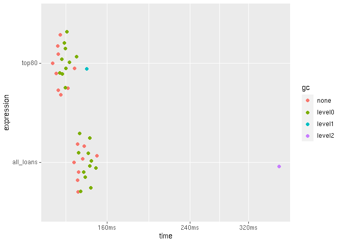

Working with big data
================
true
07-20-2020

## Setup

``` r
# Packages
library(tidyverse)
#> ── Attaching packages ────────────────────── tidyverse 1.3.0 ──
#> ✓ ggplot2 3.3.2     ✓ purrr   0.3.4
#> ✓ tibble  3.0.3     ✓ dplyr   1.0.0
#> ✓ tidyr   1.1.0     ✓ stringr 1.4.0
#> ✓ readr   1.3.1     ✓ forcats 0.5.0
#> ── Conflicts ───────────────────────── tidyverse_conflicts() ──
#> x dplyr::filter() masks stats::filter()
#> x dplyr::lag()    masks stats::lag()
library(fs)
#> Warning: package 'fs' was built under R version 4.0.2
library(vroom)
library(bench)
library(ggplot2)
library(r2dii.data)
library(r2dii.match)
packageVersion("r2dii.match")
#> [1] '0.0.3.9001'

# Example datasets
lbk_full <- loanbook_demo
ald_full <- ald_demo
```

## How do you eat an elephant?

One way to save time and memory is to use less data. Even if you
downsize your data, you may achieve the exact same result, or achieve a
slightly different result that is equally informative.

### Use just the columns you need

Your loanbook dataset may be unnecessarily big; it may have columns that
`match_name()` doesn’t use but make it less efficient. If you feed
`match_name()` with only the crucial columns it needs, you may save time
and memory.

``` r
dim(lbk_full)
#> [1] 320  19

lbk_crucial_cols <- lbk_full %>% select(crucial_lbk())
dim(lbk_crucial_cols)
#> [1] 320   6
```

Compare:

``` r
benchmark <- bench::mark(
  check = FALSE,
  iterations = 20,
  lbk_full = match_name(lbk_full, ald_demo),
  lbk_crucial_cols  = match_name(lbk_crucial_cols, ald_demo)
)

autoplot(benchmark)
```

<!-- -->

The difference here is small, but can increase with the size of the
data.

## Chunk your data

Before you saw that one way to save time and memory is to use fewer
columns of the loanbook dataset. And you can work yet more efficiently
if you use fewer rows of the ald dataset. One way is to focus on a
single sector.

``` r
dim(ald_full)
#> [1] 17368    13

ald_one_sector <- filter(ald_full, sector == "power")
dim(ald_one_sector)
#> [1] 8187   13
```

Compared to using the full datasets, this should use less time and
memory.

``` r
benchmark <- bench::mark(
  check = FALSE,
  iterations = 30,
  full = match_name(lbk_full, ald_full),
  crucial_cols_one_sector = match_name(lbk_crucial_cols, ald_one_sector)
)

autoplot(benchmark)
```

<!-- -->

To study multiple sectors you can process each one at a time. Each
result may be large, and storing it in memory may cause your computer to
crash. Instead, you can save the output of each sector to a file.

``` r
# Create a directory to store the output
directory <- "output"
if (!dir_exists(directory)) dir_create(directory)

ald_power <- filter(ald_full, sector == "power")
matched_power <- match_name(lbk_crucial_cols, ald_power)
vroom_write(matched_power, path = "output/power.csv")

ald_aviation <- filter(ald_full, sector == "aviation")
matched_power <- match_name(lbk_crucial_cols, ald_aviation)
vroom_write(matched_power, path = "output/aviation.csv")

all_sectors <- dir_ls(directory)
all_sectors
#> output/aviation.csv output/power.csv
```

When you are ready, combine all results and continue the analysis.

``` r
matched <- vroom(all_sectors)
#> Rows: 184
#> Columns: 15
#> Delimiter: "\t"
#> chr [12]: id_ultimate_parent, name_ultimate_parent, id_direct_loantaker, name_direct_loant...
#> dbl [ 3]: rowid, sector_classification_direct_loantaker, score
#> 
#> Use `spec()` to retrieve the guessed column specification
#> Pass a specification to the `col_types` argument to quiet this message
matched
#> # A tibble: 184 x 15
#>    rowid id_ultimate_par… name_ultimate_p… id_direct_loant… name_direct_loa…
#>    <dbl> <chr>            <chr>            <chr>            <chr>           
#>  1   316 UP7              Airasia X Bhd    C3               Airasia X Bhd   
#>  2   316 UP7              Airasia X Bhd    C3               Airasia X Bhd   
#>  3   317 UP8              Airbaltic        C4               Airbaltic       
#>  4   317 UP8              Airbaltic        C4               Airbaltic       
#>  5   318 UP9              Airblue          C5               Airblue         
#>  6   318 UP9              Airblue          C5               Airblue         
#>  7   319 UP10             Airborne Of Swe… C6               Airborne Of Swe…
#>  8   319 UP10             Airborne Of Swe… C6               Airborne Of Swe…
#>  9   320 UP11             Airbus Transpor… C7               Airbus Transpor…
#> 10   320 UP11             Airbus Transpor… C7               Airbus Transpor…
#> # … with 174 more rows, and 10 more variables:
#> #   sector_classification_system <chr>,
#> #   sector_classification_direct_loantaker <dbl>, id_2dii <chr>, level <chr>,
#> #   sector <chr>, sector_ald <chr>, name <chr>, name_ald <chr>, score <dbl>,
#> #   source <chr>

# How many matches per sector?
count(matched, sector)
#> # A tibble: 2 x 2
#>   sector       n
#>   <chr>    <int>
#> 1 aviation    10
#> 2 power      174
```

## Slice loanbook by row

What if your dataset is so large than even one sector is too big? Or
what if you want to try matches across sectors? You can adapt the
previous approach to match each row of the loanbook at a time against
the entire ald dataset. This can be painfully slow, but should work even
if you have little memory.

``` r
for (i in 1:nrow(lbk_crucial_cols)) {
  out <- match_name(slice(lbk_crucial_cols, i), ald_full)
  if (nrow(out) == 0L) next()
  vroom_write(out, file.path(directory, paste0(i, ".csv")))
}
```

The output directory now contains one file per matching row.

``` r
length(dir_ls(directory))
#> [1] 2
head(dir_ls(directory))
#> output/aviation.csv output/power.csv
```

But we can treat it as a single file because `vroom()` can read them all
at once and produce a single data frame.

``` r
matched2 <- vroom(dir_ls(directory))
#> Rows: 184
#> Columns: 15
#> Delimiter: "\t"
#> chr [12]: id_ultimate_parent, name_ultimate_parent, id_direct_loantaker, name_direct_loant...
#> dbl [ 3]: rowid, sector_classification_direct_loantaker, score
#> 
#> Use `spec()` to retrieve the guessed column specification
#> Pass a specification to the `col_types` argument to quiet this message
matched2
#> # A tibble: 184 x 15
#>    rowid id_ultimate_par… name_ultimate_p… id_direct_loant… name_direct_loa…
#>    <dbl> <chr>            <chr>            <chr>            <chr>           
#>  1   316 UP7              Airasia X Bhd    C3               Airasia X Bhd   
#>  2   316 UP7              Airasia X Bhd    C3               Airasia X Bhd   
#>  3   317 UP8              Airbaltic        C4               Airbaltic       
#>  4   317 UP8              Airbaltic        C4               Airbaltic       
#>  5   318 UP9              Airblue          C5               Airblue         
#>  6   318 UP9              Airblue          C5               Airblue         
#>  7   319 UP10             Airborne Of Swe… C6               Airborne Of Swe…
#>  8   319 UP10             Airborne Of Swe… C6               Airborne Of Swe…
#>  9   320 UP11             Airbus Transpor… C7               Airbus Transpor…
#> 10   320 UP11             Airbus Transpor… C7               Airbus Transpor…
#> # … with 174 more rows, and 10 more variables:
#> #   sector_classification_system <chr>,
#> #   sector_classification_direct_loantaker <dbl>, id_2dii <chr>, level <chr>,
#> #   sector <chr>, sector_ald <chr>, name <chr>, name_ald <chr>, score <dbl>,
#> #   source <chr>

count(matched2, sector)
#> # A tibble: 2 x 2
#>   sector       n
#>   <chr>    <int>
#> 1 aviation    10
#> 2 power      174
```

``` r
# Cleanup
file_delete(dir_ls(directory))
```

## Arbitrary chunks of loanbook data

Feeding `match_name()` with individual can be too slow. You can cut your
loanbook into chunks that are bigger so that the process runs faster,
yet small enough you don’t run out of memory.

``` r
# Helper
chunk_size <- function(n) as.integer(cut(row_number(), breaks = n))

size <- 10
chunked <- lbk_crucial_cols %>% 
  mutate(chunk = chunk_size(size))

chunked %>% nest_by(chunk)
#> # A tibble: 10 x 2
#> # Rowwise:  chunk
#>    chunk               data
#>    <int> <list<tbl_df[,6]>>
#>  1     1           [32 × 6]
#>  2     2           [32 × 6]
#>  3     3           [32 × 6]
#>  4     4           [32 × 6]
#>  5     5           [32 × 6]
#>  6     6           [32 × 6]
#>  7     7           [32 × 6]
#>  8     8           [32 × 6]
#>  9     9           [32 × 6]
#> 10    10           [32 × 6]
```

Now we can match the entire `ald` dataset not with an individual row but
with an individual chunk of rows.

``` r
chunks_dir <- file.path("chunks")
if (!dir.exists(chunks_dir)) dir.create(chunks_dir)

for (i in unique(chunked$chunk)) {
  out <- match_name(filter(chunked, chunk == i), ald_full)
  if (nrow(out) == 0L) next()
  vroom_write(out, file.path(directory, paste0(i, ".csv")))
}
```

## Pick the most important loans

Another option is to feed `match_name()` with data of only the loans
that make up most of the credit limit or outstanding credit limit, for
example, you may use only the largest loans that represent 80% of the
credit.

Let’s glimpse the columns that contain the pattern “loan\_size”:

``` r
lbk_full %>% 
  select(contains("loan_size")) %>% 
  glimpse()
#> Rows: 320
#> Columns: 4
#> $ loan_size_outstanding           <dbl> 225625, 301721, 410297, 233049, 40658…
#> $ loan_size_outstanding_currency  <chr> "EUR", "EUR", "EUR", "EUR", "EUR", "E…
#> $ loan_size_credit_limit          <dbl> 18968805, 19727961, 20811147, 1904286…
#> $ loan_size_credit_limit_currency <chr> "EUR", "EUR", "EUR", "EUR", "EUR", "E…
```

The `loan_size_*` values are comparable across rows because they are all
expressed in EURO:

``` r
lbk_full %>% 
  distinct(loan_size_outstanding_currency, loan_size_credit_limit_currency)
#> # A tibble: 1 x 2
#>   loan_size_outstanding_currency loan_size_credit_limit_currency
#>   <chr>                          <chr>                          
#> 1 EUR                            EUR
```

And the values in each row correspond to a unique loan:

``` r
nrow(lbk_full)
#> [1] 320
nrow(distinct(lbk_full, id_loan))
#> [1] 320
```

We can now arrange the data in descending order of the `loan_size_*`
columns, calculate the cumulative percent for each of them; and pick the
top loans that make up to 80% of the credit:

``` r
percent <- function(x) x / sum(x) * 100

top80 <- lbk_full %>% 
  arrange(desc(loan_size_credit_limit), desc(loan_size_outstanding)) %>% 
  mutate(
    cum_credit_limit = cumsum(percent(loan_size_credit_limit)),
    cum_outstanding  = cumsum(percent(loan_size_outstanding))
  ) %>% 
  filter(cum_credit_limit <= 80, cum_outstanding <= 80)

top80 %>% 
  select(id_loan, starts_with("cum_"), everything())
#> # A tibble: 207 x 21
#>    id_loan cum_credit_limit cum_outstanding id_direct_loant… name_direct_loa…
#>    <chr>              <dbl>           <dbl> <chr>            <chr>           
#>  1 L239               0.401           0.422 C164             Sanshui Beijian…
#>  2 L255               0.802           0.845 C110             Karnataka Power…
#>  3 L47                1.20            1.27  C257             Yolo County Flo…
#>  4 L81                1.60            1.69  C142             Nandi Roller Fl…
#>  5 L3                 2.00            2.11  C292             Yuama Ethanol L…
#>  6 L265               2.41            2.53  C20              Cloud Peak Ener…
#>  7 L88                2.81            2.95  C135             Nampower        
#>  8 L261               3.21            3.37  C22              Coronado Coal L…
#>  9 L84                3.61            3.79  C139             Mom and Pop Fam…
#> 10 L258               4.01            4.20  C13              Small Power Com…
#> # … with 197 more rows, and 16 more variables: id_intermediate_parent_1 <chr>,
#> #   name_intermediate_parent_1 <chr>, id_ultimate_parent <chr>,
#> #   name_ultimate_parent <chr>, loan_size_outstanding <dbl>,
#> #   loan_size_outstanding_currency <chr>, loan_size_credit_limit <dbl>,
#> #   loan_size_credit_limit_currency <chr>, sector_classification_system <chr>,
#> #   sector_classification_input_type <chr>,
#> #   sector_classification_direct_loantaker <dbl>, fi_type <chr>,
#> #   flag_project_finance_loan <chr>, name_project <lgl>,
#> #   lei_direct_loantaker <lgl>, isin_direct_loantaker <lgl>
```

The result is a dataset with considerably fewer rows that should use
less time and memory while capturing the main pattern.

``` r
round(nrow(top80) / nrow(lbk_full) * 100)
#> [1] 65
```

``` r
b <- bench::mark(
  check = FALSE,
  iterations = 30,
  all_loans = match_name(lbk_crucial_cols, ald_demo),
  top80 = match_name(select(top80, crucial_lbk()), ald_demo)
)

autoplot(b)
```

<!-- -->
