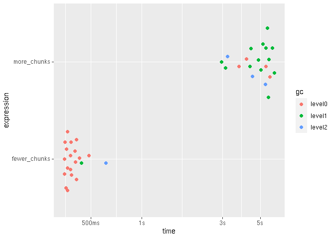

Working with big data
================
true
2020-07-30 10:08:26

## Setup

``` r
# Packages
library(tidyverse)
#> ── Attaching packages ───────────────────────────── tidyverse 1.3.0 ──
#> ✓ ggplot2 3.3.2     ✓ purrr   0.3.4
#> ✓ tibble  3.0.3     ✓ dplyr   1.0.0
#> ✓ tidyr   1.1.0     ✓ stringr 1.4.0
#> ✓ readr   1.3.1     ✓ forcats 0.5.0
#> ── Conflicts ──────────────────────────────── tidyverse_conflicts() ──
#> x dplyr::filter() masks stats::filter()
#> x dplyr::lag()    masks stats::lag()
library(fs)
#> Warning: package 'fs' was built under R version 4.0.2
library(vroom)
library(bench)
library(ggplot2)
library(r2dii.data)
library(r2dii.match)
packageVersion("r2dii.match")
#> [1] '0.0.3.9001'

# Example datasets
lbk_full <- loanbook_demo
ald_full <- ald_demo
```

## How do you eat an elephant?

One way to save time and memory is to use less data. Even if you
downsize your data, you may achieve the exact same result, or achieve a
slightly different result that is equally informative.

### Use just the columns you need

Your loanbook dataset may be unnecessarily big; it may have columns that
`match_name()` doesn’t use but make it less efficient. If you feed
`match_name()` with only the crucial columns it needs, you may save time
and memory.

``` r
lbk_full %>% dim()
#> [1] 320  19
lbk_smaller <- lbk_full %>% select(crucial_lbk())
lbk_smaller %>% dim()
#> [1] 320   6
```

Compare:

``` r
benchmark <- mark(
  check = FALSE,
  iterations = 20,
  bigger   = match_name(lbk_full, ald_demo),
  smaller  = match_name(lbk_smaller, ald_demo)
)

benchmark %>% autoplot()
```

<!-- -->

The difference here is small, but can increase with the size of the
data.

## Chunk your data

Before you saw that one way to save time and memory is to use fewer
columns of the loanbook dataset. And you can work yet more efficiently
is to feed `match_name()` with fewer rows of data.

### Feed `match_name()` one `ald` sector at a time

One way is to focus on a single sector. The `loanbook` dataset lacks an
explicit `sector` column, but the `ald` dataset has it; thus you can
filter one specific sector and work with it.

``` r
unique(ald_full$sector)
#> [1] "power"       "cement"      "oil and gas" "shipping"    "aviation"   
#> [6] "coal"        "automotive"  "steel"

ald_full %>% dim()
#> [1] 17368    13

ald_full %>% filter(sector == "power") %>% dim()
#> [1] 8187   13
```

Compared to using the full datasets, this should use less time and
memory.

``` r
benchmark <- mark(
  check = FALSE,
  iterations = 20,
  bigger = match_name(lbk_full, ald_full),
  smaller = match_name(lbk_smaller, filter(ald_full, sector == "power"))
)

benchmark %>% autoplot()
```

<!-- -->

To study multiple sectors you can process each one at a time. Each
result may be large, and may not fit in your computer’s memory; but you
can save the output of each sector to a file.

``` r
if (!dir_exists("sectors")) dir_create("sectors")

power <- match_name(lbk_smaller, filter(ald_full, sector == "power"))
power %>% vroom_write(path("sectors", "power.csv"))

aviation <- match_name(lbk_smaller, filter(ald_full, sector == "aviation"))
aviation %>% vroom_write(path("sectors", "aviation.csv"))

dir_ls("sectors")
#> sectors/aviation.csv sectors/power.csv
```

When you are ready, combine all results and continue the analysis.

``` r
sectors <- dir_ls("sectors") %>% vroom()
#> Rows: 184
#> Columns: 15
#> Delimiter: "\t"
#> chr [12]: id_ultimate_parent, name_ultimate_parent, id_direct_loantaker, name_direct_loant...
#> dbl [ 3]: rowid, sector_classification_direct_loantaker, score
#> 
#> Use `spec()` to retrieve the guessed column specification
#> Pass a specification to the `col_types` argument to quiet this message
sectors
#> # A tibble: 184 x 15
#>    rowid id_ultimate_par… name_ultimate_p… id_direct_loant… name_direct_loa…
#>    <dbl> <chr>            <chr>            <chr>            <chr>           
#>  1   316 UP7              Airasia X Bhd    C3               Airasia X Bhd   
#>  2   316 UP7              Airasia X Bhd    C3               Airasia X Bhd   
#>  3   317 UP8              Airbaltic        C4               Airbaltic       
#>  4   317 UP8              Airbaltic        C4               Airbaltic       
#>  5   318 UP9              Airblue          C5               Airblue         
#>  6   318 UP9              Airblue          C5               Airblue         
#>  7   319 UP10             Airborne Of Swe… C6               Airborne Of Swe…
#>  8   319 UP10             Airborne Of Swe… C6               Airborne Of Swe…
#>  9   320 UP11             Airbus Transpor… C7               Airbus Transpor…
#> 10   320 UP11             Airbus Transpor… C7               Airbus Transpor…
#> # … with 174 more rows, and 10 more variables:
#> #   sector_classification_system <chr>,
#> #   sector_classification_direct_loantaker <dbl>, id_2dii <chr>, level <chr>,
#> #   sector <chr>, sector_ald <chr>, name <chr>, name_ald <chr>, score <dbl>,
#> #   source <chr>
```

Let’s see how many matches we got per sector:

``` r
sectors %>% count(sector)
#> # A tibble: 2 x 2
#>   sector       n
#>   <chr>    <int>
#> 1 aviation    10
#> 2 power      174
```

Cleanup:

``` r
dir_delete("sectors")
```

### Feed `match_name()` one `loanbook` chunk at a time

You can feed `match_name()` with “chunks” of your `loanbook` dataset
that are bigger than a single row, yet small enough you can process each
chunk with whatever memory you have.

Let’s create two helper functions: `chunkid()` to identify all rows in a
loanbook that belong to the same chunk, and `vroom_chunks()` to write a
.csv file with the results of matching each `loanbook` chunk against the
entire `ald` dataset.

``` r
chunkid <- function(n) as.integer(cut(row_number(), breaks = n))

vroom_chunks <- function(path, loanbook, ald, ...) {
  stopifnot(hasName(loanbook, "chunkid"))
  
  if (!dir_exists(path)) dir_create(path)
  
  for (i in unique(loanbook$chunkid)) {
    matched <- match_name(filter(loanbook, chunkid == i), ald, ...)
    
    if (nrow(matched) == 0L) next()
    matched %>% vroom_write(path(path, paste0(i, ".csv")))
  }
  
  invisible(path)
}
```

Processing time increases with increasing number of chunks

``` r
three_chunks <- mutate(lbk_smaller, chunkid = chunkid(3))
thirty_chunks <- mutate(lbk_smaller, chunkid = chunkid(30))

benchmark <- mark(
  check = FALSE,
  iterations = 20,
  
  three_chunks  = path3 <- suppressWarnings(
    vroom_chunks(path(path_temp(), "3"), three_chunks, ald_full)
  ),
  thirty_chunks  = path30 <- suppressWarnings(
    vroom_chunks(path(path_temp(), "30"), thirty_chunks, ald_full)
  )
)
#> Warning: Some expressions had a GC in every iteration; so filtering is disabled.

benchmark %>% autoplot()
```

<!-- -->

Explore the result:

``` r
dir_ls(path3)
#> /tmp/RtmpD8xCVY/3/1.csv /tmp/RtmpD8xCVY/3/2.csv /tmp/RtmpD8xCVY/3/3.csv

chunks <- dir_ls(path30) %>% vroom()
#> Rows: 497
#> Columns: 16
#> Delimiter: "\t"
#> chr [12]: id_ultimate_parent, name_ultimate_parent, id_direct_loantaker, name_direct_loant...
#> dbl [ 4]: rowid, sector_classification_direct_loantaker, chunkid, score
#> 
#> Use `spec()` to retrieve the guessed column specification
#> Pass a specification to the `col_types` argument to quiet this message
chunks %>% nest_by(sector)
#> # A tibble: 6 x 2
#> # Rowwise:  sector
#>   sector                     data
#>   <chr>       <list<tbl_df[,15]>>
#> 1 automotive            [98 × 15]
#> 2 aviation              [10 × 15]
#> 3 cement                [42 × 15]
#> 4 oil and gas           [68 × 15]
#> 5 power                [174 × 15]
#> 6 shipping             [105 × 15]

chunks
#> # A tibble: 497 x 16
#>    rowid id_ultimate_par… name_ultimate_p… id_direct_loant… name_direct_loa…
#>    <dbl> <chr>            <chr>            <chr>            <chr>           
#>  1     1 UP15             Alpine Knits In… C294             Yuamen Xinneng …
#>  2     3 UP288            University Of I… C292             Yuama Ethanol L…
#>  3     5 UP104            Garland Power &… C305             Yukon Energy Co…
#>  4     5 UP104            Garland Power &… C305             Yukon Energy Co…
#>  5     6 UP83             Earthpower Tech… C304             Yukon Developme…
#>  6     6 UP83             Earthpower Tech… C304             Yukon Developme…
#>  7     8 UP163            Kraftwerk Mehru… C303             Yueyang City Co…
#>  8     9 UP138            Jai Bharat Gum … C301             Yuedxiu Corp One
#>  9    10 UP32             Bhagwan Energy … C302             Yuexi County AA…
#> 10    11 UP81             Dynegy Midwest … C309             Yuxi ounty Liua…
#> # … with 487 more rows, and 11 more variables:
#> #   sector_classification_system <chr>,
#> #   sector_classification_direct_loantaker <dbl>, chunkid <dbl>, id_2dii <chr>,
#> #   level <chr>, sector <chr>, sector_ald <chr>, name <chr>, name_ald <chr>,
#> #   score <dbl>, source <chr>
```

Cleanup:

``` r
dir_delete(path3)
dir_delete(path30)
```

## Pick the most important loans

Another option is to feed `match_name()` with data of only the loans
that make up most of the credit limit or outstanding credit limit, for
example, you may use only the largest loans that represent 80% of the
credit.

Let’s glimpse the columns that contain the pattern “loan\_size”:

``` r
lbk_full %>% 
  select(contains("loan_size")) %>% 
  glimpse()
#> Rows: 320
#> Columns: 4
#> $ loan_size_outstanding           <dbl> 225625, 301721, 410297, 233049, 40658…
#> $ loan_size_outstanding_currency  <chr> "EUR", "EUR", "EUR", "EUR", "EUR", "E…
#> $ loan_size_credit_limit          <dbl> 18968805, 19727961, 20811147, 1904286…
#> $ loan_size_credit_limit_currency <chr> "EUR", "EUR", "EUR", "EUR", "EUR", "E…
```

The `loan_size_*` values are comparable across rows because they are all
expressed in EURO:

``` r
lbk_full %>% 
  distinct(loan_size_outstanding_currency, loan_size_credit_limit_currency)
#> # A tibble: 1 x 2
#>   loan_size_outstanding_currency loan_size_credit_limit_currency
#>   <chr>                          <chr>                          
#> 1 EUR                            EUR
```

And the values in each row correspond to a unique loan:

``` r
nrow(lbk_full)
#> [1] 320
nrow(distinct(lbk_full, id_loan))
#> [1] 320
```

We can now arrange the data in descending order of the `loan_size_*`
columns, calculate the cumulative percent for each of them; and pick the
top loans that make up to 80% of the credit:

``` r
percent <- function(x) x / sum(x) * 100

top80 <- lbk_full %>% 
  arrange(desc(loan_size_credit_limit), desc(loan_size_outstanding)) %>% 
  mutate(
    cum_credit_limit = cumsum(percent(loan_size_credit_limit)),
    cum_outstanding  = cumsum(percent(loan_size_outstanding))
  ) %>% 
  filter(cum_credit_limit <= 80, cum_outstanding <= 80)

top80 %>% 
  select(id_loan, starts_with("cum_"), everything())
#> # A tibble: 207 x 21
#>    id_loan cum_credit_limit cum_outstanding id_direct_loant… name_direct_loa…
#>    <chr>              <dbl>           <dbl> <chr>            <chr>           
#>  1 L239               0.401           0.422 C164             Sanshui Beijian…
#>  2 L255               0.802           0.845 C110             Karnataka Power…
#>  3 L47                1.20            1.27  C257             Yolo County Flo…
#>  4 L81                1.60            1.69  C142             Nandi Roller Fl…
#>  5 L3                 2.00            2.11  C292             Yuama Ethanol L…
#>  6 L265               2.41            2.53  C20              Cloud Peak Ener…
#>  7 L88                2.81            2.95  C135             Nampower        
#>  8 L261               3.21            3.37  C22              Coronado Coal L…
#>  9 L84                3.61            3.79  C139             Mom and Pop Fam…
#> 10 L258               4.01            4.20  C13              Small Power Com…
#> # … with 197 more rows, and 16 more variables: id_intermediate_parent_1 <chr>,
#> #   name_intermediate_parent_1 <chr>, id_ultimate_parent <chr>,
#> #   name_ultimate_parent <chr>, loan_size_outstanding <dbl>,
#> #   loan_size_outstanding_currency <chr>, loan_size_credit_limit <dbl>,
#> #   loan_size_credit_limit_currency <chr>, sector_classification_system <chr>,
#> #   sector_classification_input_type <chr>,
#> #   sector_classification_direct_loantaker <dbl>, fi_type <chr>,
#> #   flag_project_finance_loan <chr>, name_project <lgl>,
#> #   lei_direct_loantaker <lgl>, isin_direct_loantaker <lgl>
```

The result is a dataset with considerably fewer rows that should use
less time and memory while capturing the main pattern.

``` r
round(nrow(top80) / nrow(lbk_full) * 100)
#> [1] 65
```

``` r
benchmark <- mark(
  check = FALSE,
  iterations = 20,
  all_loans = match_name(lbk_smaller, ald_demo),
  top80 = match_name(select(top80, crucial_lbk()), ald_demo)
)

benchmark %>% autoplot()
```

<!-- -->
